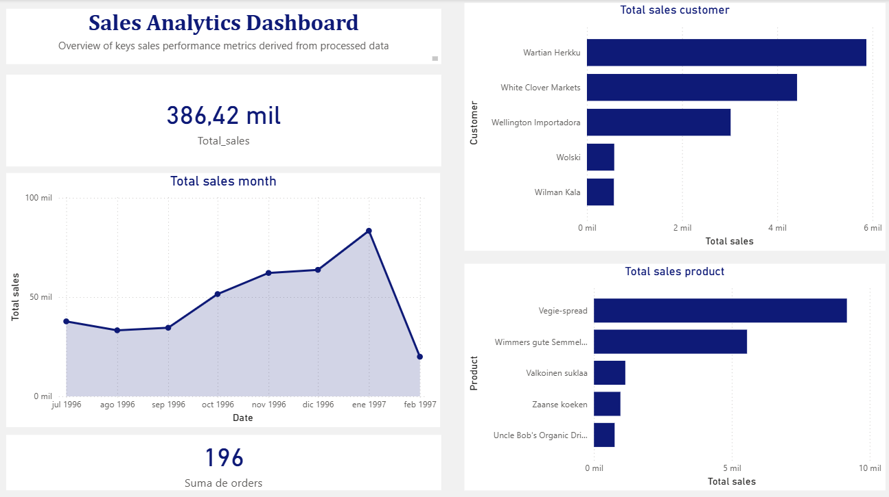

# Sales Analytics Pipeline & BI Dashboard

## 📌 Executive Summary

This project simulates a real-world data engineering workflow using the Northwind dataset.

The objective was to design and implement a reproducible data pipeline that transforms relational raw data into analytics-ready datasets and business intelligence outputs.

Pipeline Flow:

Relational Database → SQL Extraction → Raw Layer → Processing Layer → Analytics Layer → BI Dashboard

---

## 🏗️ Data Architecture

The project follows a layered data architecture inspired by modern data engineering practices.

data/
├── raw/            # Immutable raw dataset exported from SQL  
├── processed/      # Cleaned and enriched dataset  
├── analytics/      # Aggregated, business-ready datasets  
sql/  
├── raw_sales_export.sql  
python/  
├── pipeline.py  
powerbi/  
├── pipeline_dashboard.pbix  

### Layer Description

**Raw Layer**
- Flat dataset generated via SQL joins
- No transformations applied
- Serves as the immutable source for reproducibility

**Processed Layer**
- Explicit type casting (datetime conversion)
- Feature engineering (Year, Month, YearMonth)
- Data validation checks
- Clean structure for downstream aggregation

**Analytics Layer**
- Pre-aggregated business metrics
- Monthly revenue
- Product-level performance
- Customer-level revenue contribution

This separation improves:
- Maintainability
- Debugging
- Reproducibility
- Scalability mindset

---

## 🛠️ Technical Stack

- SQL (relational joins & dataset flattening)
- Python (Pandas for transformation and aggregation)
- Power BI (data visualization)
- Git & GitHub (version control and project structure)

---

## 🔄 Data Pipeline Implementation

### 1️⃣ SQL Extraction

Created a denormalized dataset using multi-table joins:

- Orders
- OrderDetails
- Products
- Customers

Computed derived metric:
- LineTotal = Quantity × UnitPrice

Exported as CSV to serve as the raw ingestion layer.

---

### 2️⃣ Data Processing (Python)

Key transformations:

- Explicit datetime casting
- Feature engineering for time-series analysis
- Data quality assertions:
  - Positive quantities
  - Positive pricing
  - Non-zero total revenue
- Validation of aggregated totals against SQL results

The pipeline is fully reproducible by running:

python pipeline.py

---

### 3️⃣ Aggregation Strategy

Generated analytics-ready datasets:

- monthly_sales.csv
- product_sales.csv
- customer_sales.csv

Aggregations include:

- Total revenue
- Total quantity
- Unique order counts
- Revenue ranking

These datasets are optimized for BI consumption.

---

## 📊 Business Intelligence Layer

Power BI dashboard built on the analytics layer including:

- KPI Card (Total Revenue)
- Monthly Sales Trend (Time Series)
- Top 5 Products by Revenue
- Interactive Year filter

Design focus:
- Clean layout
- Minimalist corporate styling
- Business readability

---

## 🧠 Engineering Principles Applied

- Layered architecture
- Reproducible transformations
- Data validation checks
- Separation of concerns
- BI-ready aggregation design
- Clean repository structure

---

## 🚀 What This Project Demonstrates

- Relational data modeling understanding
- SQL join logic & metric computation
- Data cleaning & transformation pipelines
- Analytical dataset design
- End-to-end ownership of data workflow
- Ability to bridge Data Engineering and BI

---

## 📷 Dashboard Preview

